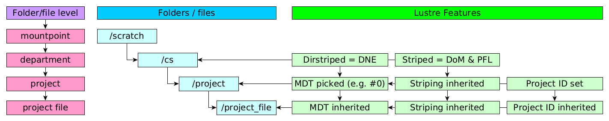

# clusterstor-scripts

This repository contains various scripts to be used with HPE ClusterStor system (2021).

**This is a copy of the internal repository, but functionality should be the same.**

**Authors do not take any liability for the use of this code.**

These scripts help to manage a directory structure such as this:



Different Lustre features are implemented on different levels of the folder structure:

- Distributed NamespacE (DNE) is created by creating department folders with a dirstripe.
- Data on Metadata (DoM) and Progressive File Layout (PFL) are implemented by setting striping
  on department folders. This striping structure can be updated on project level as well.
- Project quotas are implemented on a project level. Each created project will have a project
  ID that matches the project group's GID. The project IDs can be verified/updated as well.

## Installation

The scripts utilizes two Python packages:
[PyYAML](https://pyyaml.org/wiki/PyYAMLDocumentation) and
[sh](https://amoffat.github.io/sh/).

On CentOS 7, these can be installed with:

```sh
yum install python36-PyYAML python36-sh
```

## Configuration

Example configuration might look something like this:

```yaml
defaults:
  stripe_parameters: -E 65536 -L mdt -E 1G -c 1 -S 4M -E 64G -c 4 -S 4M -E 1T -c 8
    -S 4M -E -1 -c -1 -S 4M
  stripe_parameter_reference: "striping-reference.yml"
  dirstripe_count: 2
  mountpoint: "/mnt/lustre/clusterstor-scripts-test"
  users_group: "my_users"
  work_dir_name: "work"
  default_quotas:
    projects:
      byte_quota: 200G
      inode_quota: 1M
    workdir:
      byte_quota: 200G
      inode_quota: 1M
project_dirs:
  # Create department project
  cs:
    cs_project1:
      byte_quota: 1T
      inode_quota: 1M
    cs_project2:
      byte_quota: 2T
      inode_quota: 10M
  phys:
    # Use default quotas
    phys_project1: {}
work_dirs:
  # Set user quota
  username1:
    byte_quota: 2T
    inode_quota: 10M
```

Configuration parameters are:

- `defaults` - Default values for the scripts.
- `defaults.stripe_parameters` - Striping (for DoM & PFL) parameters that are done for department
  folders and project folders.
- `defaults.stripe_parameter_reference` - A reference for the desired striping state. Created by
  `lfs getstripe -d --yaml /folder/with/correct/striping`.
- `defaults.dirstripe_count` - Default dirstripe count for department folders.
- `defaults.mountpoint` - Mountpoint for the Lustre filesystem.
- `defaults.work_dir_name` - Name for the root directory for users' workdirs.
- `defaults.users_group` - AD group that will be searched for users for workdir creation.
- `defaults.default_quotas` - Dictionary of default quotas for projects and work folders.
- `defaults.default_quotas.projects` - Quotadict that defines default byte and inode quotas for projects.
- `defaults.default_quotas.workdir` - Quotadict that defines default byte and inode quotas for workdir.
- `project_dirs` - Dictonary that contains the project dir structure.
- `project_dirs.dept1` - Dictonary that contains projects for department `dept1`.
- `project_dirs.dept1.project1` - Quotadict that contains project quota for `project1` of department `dept1`.
  Can be partially or completely empty as well. Defaults will be used for missing values.
- `work_dirs` - Dictonary that contains the workdir structure.
  Users that are not in `work_dirs` are created using default quotas.
- `work_dirs.user1`- Quotadict that contains workdir quota for `user1`.
  Can be partially or completely empty as well. Defaults will be used for missing values.

Quotadicts are dictionaries that have the following keys:

- `byte_quota` - Hard limit of bytes for project quota. Needs to be a string.
  Can have suffixes `kMGTPE` for bigger units.
- `inode_quota` - Hard limit of inodes for project quota. Needs to be a string.
  Can have suffixes `kMGTPE` for bigger units.

## Scripts

### `create_project_dirs`

`create_project_dirs` creates departments, projects and user directories.
It does the following:

1. It creates deparment folders with correct dirstriping.
2. It sets striping for newly created department folders.
3. It creates desired project folders.
4. It sets correct project ID to project folders.
5. It sets the correct quota for project IDs.
6. Optionally, it checks that all folders have the correct striping.
7. Optionally, it checks that all folders have the correct project ID.
8. Optionally, it checks that all folders have the correct project quota.

Throughout this process the script will ask for confirmation if changes are going to be done.

To run it, one simply runs:

```sh
./create_project_dirs
```

By default is runs in dry-run mode. In this mode, no changes are made.
To commit changes, one needs to run the script with `-c/--commit`-flag.
For more information on what the script does, run with `-v/--verbose`-flag.

One can also test creation of the project structure by running the script
with the `test.yaml`:
```sh
./create_project_dirs --site-conf test.yaml -c
```

Run

```sh
./create_project_dirs --help
```

for all features and parameters.


### `create_work_dirs`

`create_work_dirs` creates user directories.
It does the following:

1. It creates main `work`-directory with correct dirstriping.
2. It sets striping for newly created work folder.
3. It checks `users_group` for users to manage.
4. It creates user folder for each user.
5. It sets correct project ID to user folders.
6. It sets the correct quota for users' project IDs.
7. Optionally, it checks that all folders have the correct striping.
8. Optionally, it checks that all folders have the correct project ID.
9. Optionally, it checks that all folders have the correct project quota.

Throughout this process the script will ask for confirmation if changes are going to be done.

To run it, one simply runs:

```sh
./create_work_dirs
```

By default is runs in dry-run mode. In this mode, no changes are made.
To commit changes, one needs to run the script with `-c/--commit`-flag.
For more information on what the script does, run with `-v/--verbose`-flag.

Run

```sh
./create_work_dirs --help
```

for all features and parameters.

## `clusterstor_tools`-package

The Python package contains functions that do the modifications. Various security checks have been
added to make certain that the filesystem structure matches the desired one.
